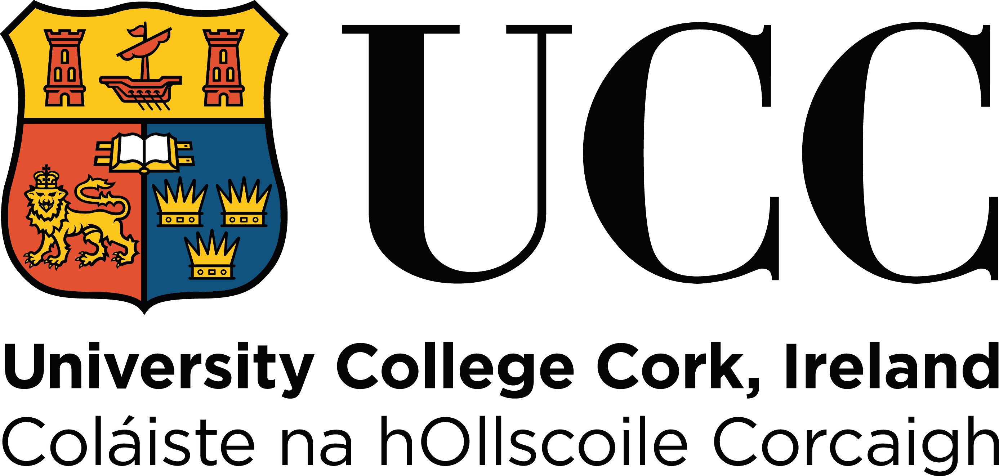
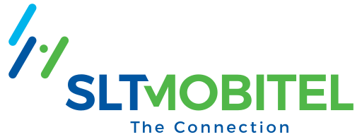
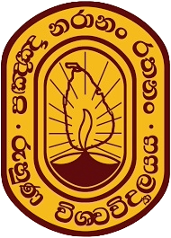

# 🎓 Academic Experience

---

## 🏛 **Marie Curie Early Stage Researcher**  
📍 **University College Cork, Ireland**  
🗓 **Sep 2024 – Present (7 months)**  

- Conducting research in **computational semantic change detection**.  
- Working under the **CASCADE Horizon Europe MSCA** project.  
- Developing **Large Language Model (LLM)-based text reuse detection**.

---

## 📚 **Visiting Lecturer**  
📍 **Sri Lanka Telecom Training Center**  
🗓 **Aug 2023 – Sep 2024 (1 year, 2 months)**  
📍 **Welisara · On-site**  

### 🔹 Courses Taught:
- **Fundamentals of Artificial Intelligence (AI) & Intelligent Systems**  
- **Big Data & Visualization**  
- **Business Intelligence**  
- **Internet of Things (IoT)**  
- **Advanced Python Programming**

**Skills Gained:**  
✅ Guest Lecturing | ✅ NLP | ✅ Technical Training | ✅ Higher Education Teaching  

---

## 📚 **Visiting Lecturer**  
📍 **Faculty of Engineering, University of Ruhuna**  
🗓 **Aug 2023 – Sep 2024 (1 year, 2 months)**  
📍 **Galle, Sri Lanka · Hybrid**  

### 🔹 Courses Taught:
- **Cleaning Data, Handling Missing Values & Outlier Detection**  
- **Data Splitting & Cross-Validation Techniques**  
- **Introduction to Data Visualization with PowerBI**  
- **Excel for Data Science**

**Skills Gained:**  
✅ Data Cleaning | ✅ Data Visualization | ✅ Machine Learning | ✅ Teaching  

👉 Return to [🏠 Homepage](index.md)  
