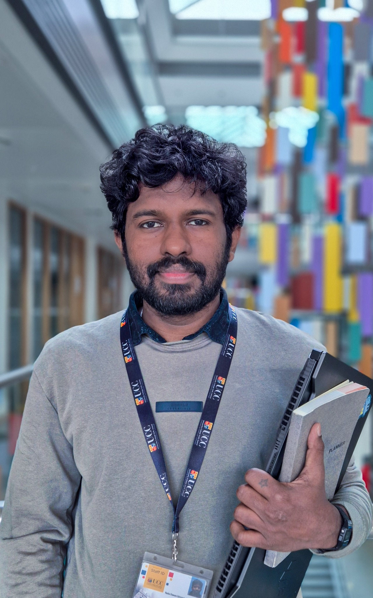

[🏠 Home](index.md) [📌 Current Status](current_status.md) [🎓 Academic Experience](academic_experience.md) [💼 Industry Experience](industry_experience.md)  
[📘 Education](education.md) [📄 Publications](publications.md) [📢 Presentations & Academic Contributions](Presentations_Contributions.md)

---

---

    
    

        <h2>🚀 NLP | Machine Learning | Deep Learning | Transformers | Applied Data Visualization</h2>
        
🔍 <strong>Research Focus:</strong> Language Modelling & Visualization for Parallel Text Analysis

        
📍 <strong>University College Cork, Ireland</strong>

        
📧 <a href="mailto:rasikahendrix@gmail.com">Personal</a> | <a href="mailto:rasika.edirisinghe@ucc.ie">Official</a>

        

            🔗 <a href="https://www.linkedin.com/in/rasika-chamara/">LinkedIn</a> | 
            📂 <a href="https://github.com/mrHendrixSL/">GitHub</a> | 
            📖 <a href="https://orcid.org/0009-0008-4673-0259">ORCID</a> | 
            🎓 <a href="https://scholar.google.com/citations?user=o_7ZjgMAAAAJ&hl=en">Google Scholar</a>
        

    

---

## 🔬 **About Me**  
I am a researcher exploring **Natural Language Processing (NLP), Deep Learning, and Computational Semantics**. My research is under the **[CASCADE](https://www.horizoncascade.net/) Horizon Europe MSCA** project where we investigate **semantic change detection across different environments**.  

### 📌 **Current Work:**
- Developing **advanced text reuse detection** systems with **Large Language Models (LLMs)**.
- Tackling challenges in **unstable spellings, context sensitivity, and parallel text analysis**.
- Enhancing **AI interpretability** through **interactive visualization techniques**.

---

