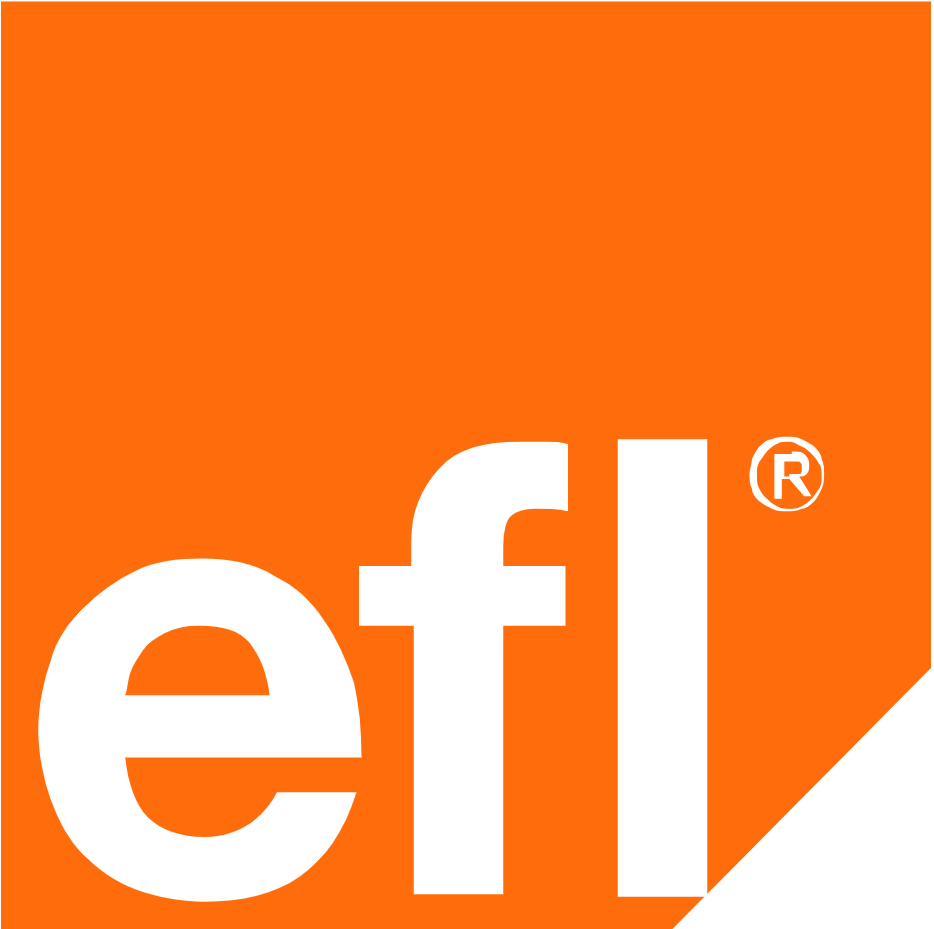
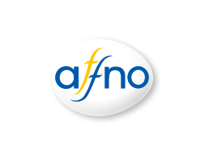
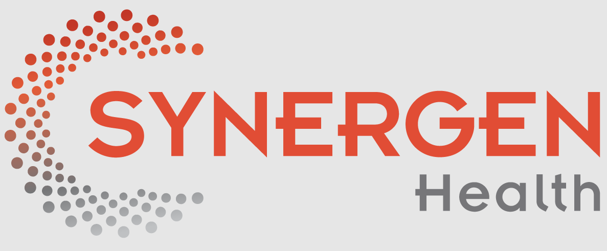

# 💼 Industry Experience

---

## 📊 **Data Analyst**  
📍 **EFL Global | Hybrid**  
🗓 **May 2023 – Sep 2024 (1 year, 5 months)**  
📍 **Colombo, Sri Lanka**  

### 🔹 Key Responsibilities:
- Developed **automation scripts (Python & VBA)** for **data wrangling**.  
- Partnered with **BI teams** to optimize **Power BI dashboards**.  
- Maintained **Azure Databricks**, ensuring optimal **data quality & integrity**.  
- Troubleshot **data pipeline issues** to prevent processing failures.

**Skills Gained:**  
✅ Data Wrangling | ✅ Power BI | ✅ Azure Databricks | ✅ Automation  

---

## 🛠 **Implementation Engineer**  
📍 **Affno Virtual Market**  
🗓 **Nov 2022 – May 2023 (7 months)**  
📍 **Colombo, Sri Lanka**  

### 🔹 Key Responsibilities:
- Designed **data visualization solutions** using **Tableau & Power BI**.  
- Conducted **business process analysis** for optimizing supply chain analytics.  
- Assisted in **software implementation & flow chart development**.  

**Skills Gained:**  
✅ Tableau | ✅ Business Analytics | ✅ KPI Implementation | ✅ Data Science  

---

## 🏥 **Operations Analyst**  
📍 **SYNERGEN Health | Full-time**  
🗓 **Mar 2019 – Nov 2022 (3 years, 9 months)**  
📍 **Colombo, Sri Lanka**  

### 🔹 Key Responsibilities:
- Specialized in **US Healthcare Revenue Cycle Management**.  
- Managed **data processes, reporting, and problem resolution** for multiple clients.  
- Automated **reporting pipelines using Python & VBA**.

**Skills Gained:**  
✅ Healthcare Data | ✅ Business Intelligence | ✅ Web Mining | ✅ Power BI  

👉 Return to [🏠 Homepage](index.md)  
